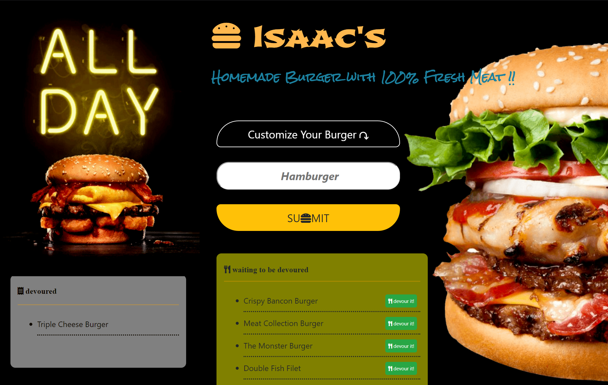
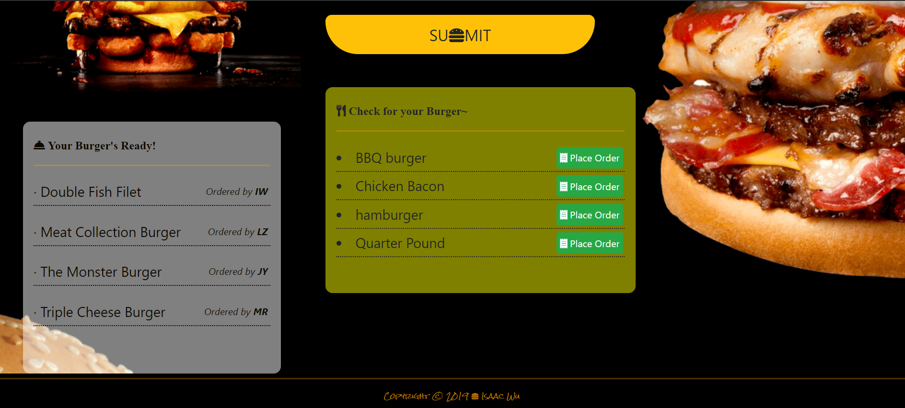
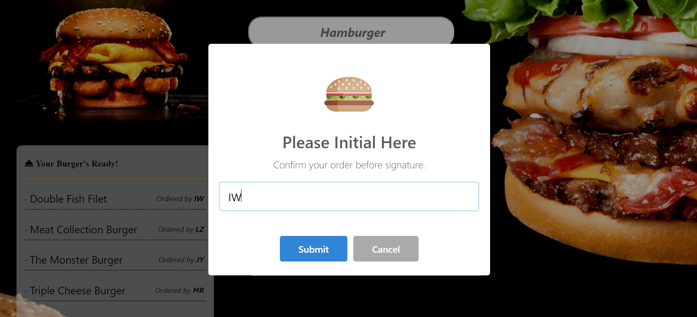

# 🍔Eat-Da-Burger

####   :point_right: Click  **[>>>Here<<<](https://dashboard.heroku.com/apps/eatdaburger2-iw)**  Check APP demo.

* Eat-Da-Burger! is a restaurant app that lets users input the names of burgers they'd like to eat.

* Whenever a user submits a burger, Eat-Da-Burger! will display the burger's name in the 'Check for your Burger' list.

* Each burger in the waiting area also has a `Place Order` button.

* When the user check out, the system will ask for user's name initial, and then burger will move to the left side of the page.

V 1.0.0

V 2.0.0

Eat-Da-Burger! built with Node Express and Sequelize

## Author
* [Isaac Wu](https://github.com/squall2046)
* [GitHub Repo](https://github.com/squall2046/Eat-Da-Burger-Sequel)

## Copyright
Isaac Wu © 2019 All Rights Reserved
